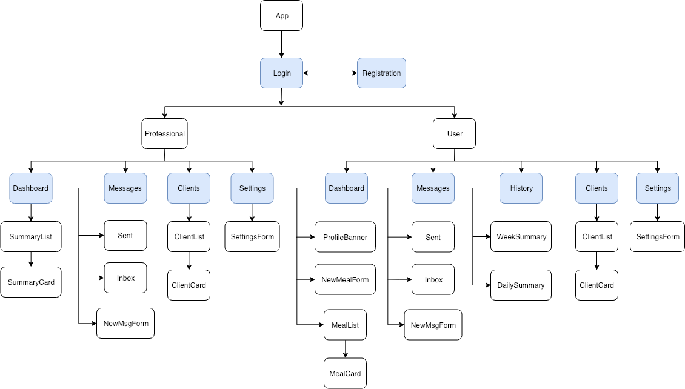

# nutritrack

## Proposal

#### Project Description

NutriTrack is a gamefied nutrition tracking application designed to help users observe their daily nutritional habits and build actionable tasks from those habits. The application will be available freely available to any new user but the real power of NutriTrack begins to show when users integrate their profile with other IoT devices and associate their profile with a team ofprofessional working together to meet their needs. As users go about their day, a simple and intuitive UI allows users to quicly add nutritional information to their daily record by pulling information from the largest, professionally kept database of nutritional information in the world. Nutritional information from these records then gets tallied and the user is given feedback regarding their daily nutritional intake allowing them to make informed decisions regarding their next meal. Daily and weekly aggregates are recorded and displayed so users can track their weekly and monthly habits. Ultimately, this information can also become available to a private team of health care providers and nutritionists allowing users to build a wholistic and honest approach to their specific goals.

#### What Problem Does This Project Solve?

NutriTrack seeks to simplify nutritional tracking and reward users with instant feedback in order to further use the application. This way users can choose to use this data to build specific goals and metrics alongside a nutritional expert of their choosing in order to meet their goals.

#### Who is this designed for?

Often times the medical care provided to patients with Diabetes is closely tied to a journal of their nutritional habits that they are asked to keep. This means the quality of care they are provided often relies on an arcane and difficult method of tracking. NutriTrack looks to eliminate the guesswork out of this process by aggregating information from a large nutritional database. In this way a user can log their information through a quick auto-completed search. Finding consistent and meaningful nutritional information becomes as quick and easy and finding your #2 Combo via the search bar. For other people who do not have specific medical or nutritional goals the application is useful for anyone interested in the quantified self. Users can monitor their habits and use this information to see how diet ties into their quality of life. Were you stressed at work? Are you a stress-eater, or do you just forget to eat? Having trouble falling asleep lately? Maybe this week you're dinner was much heavier than you typically eat? Upset stomach and you don't know why? Well according to your NutriTrack records it looks like the last time this happened you'd eaten a soy burger as well.

#### Technology List

###### Front-End:
- VueJs, Vuex, VueRouter (SPA)
- Vuetify (Styling)

###### Back-End:
- Java
- Spring
- JWT (authentication)
- (Redis) (caching) (*stretch*)

## Component Tree

## User Stories

#### Landing Page
- As a user, when I arrive at the landing page I see a navigation bar with the option to Login or Register as a new user.
- Login button renders a corresponding login form.
- Register button renders a corresponding registration form.

### Professional

#### Dashboard
###### Layout:
- As a Professional user I see a list displaying a high-level overview of all of my clients recent statistics.
- As a professional user, I see a permanent navigation field on the left.
###### Functionality:
- As a user, when I click a client card I am navigated to that clients profile page including a more detailed summary.

#### Messages
###### Layout:
- As a user, I can see a summary view of all of my messages via the 'inbox' category.
- As a user, I can see a summary view of all of my messages via the 'sent' category.
- As a user, I can see a new message form collapsed at the top of the screen.
###### Functionality:
- As a user, I can filter my messages by a 'sent' category.
- As a user, I can reply to an existing message.
- As a user, I can compose a new message to send to another user.

#### Clients

### User

#### Dashboard
####### Layout:
- As a user, when I login I see a banner displaying my current intake broken up into nutritional categories
- Below the summary banner, I see a list of meal cards corresponding to that day's input
- As a user, I see a fixed floating button in the bottom right to add new meal cards
####### Functionality:
- As a user, I can add new meals via a modal form upon pressing the 'add' button
- As a user, I can see a detailed view beyond the macroscopic view of nutritional information displayed in a meal card

#### Messages
###### Layout:
- As a user, I can see a summary view of all of my messages via the 'inbox' category.
- As a user, I can see a summary view of all of my messages via the 'sent' category.
- As a user, I can see a new message form collapsed at the top of the screen.
###### Functionality:
- As a user, I can filter my messages by a 'sent' category.
- As a user, I can reply to an existing message.
- As a user, I can compose a new message to send to another user.

#### History

#### Allies

#### Settings